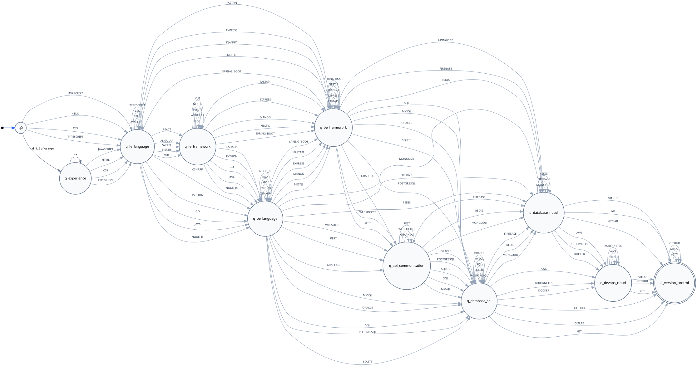
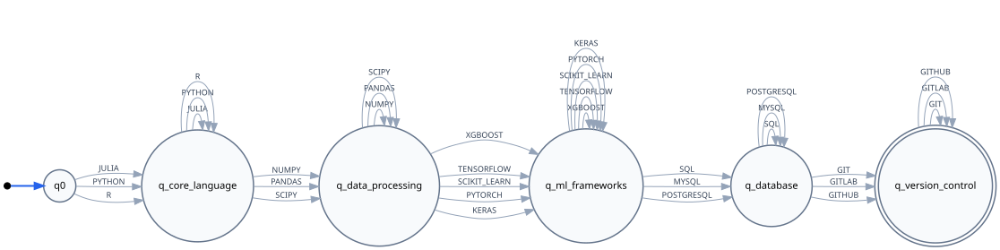
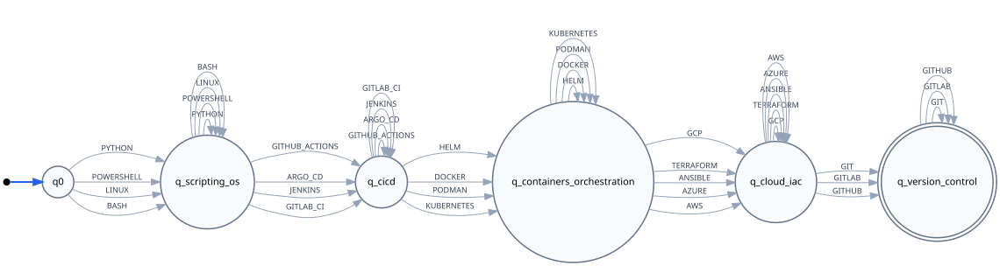
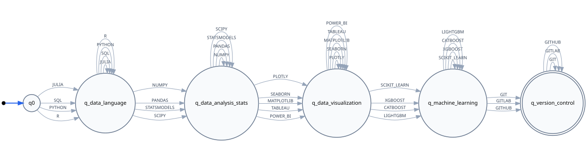

# ResumeLens — Etapa 3: Reconocimiento de Patrones de Cualificación con Autómatas Finitos

## 1. Introducción y Objetivo de la Etapa 3

En el flujo de **ResumeLens**, la Etapa 3 constituye el **Motor de Clasificación y Lógica Formal**. Su objetivo es recibir la secuencia de competencias técnicas normalizadas y ordenadas canónicamente (generadas por la Etapa 2 de Transductores Finitos) y determinar formalmente si el candidato cumple con el patrón de cualificación requerido para uno o más perfiles profesionales.

La clasificación no es un ranking heurístico ni un juicio subjetivo de contratación: **es un reconocimiento estricto de pertenencia a un lenguaje regular formal** definido sobre el alfabeto de cualificaciones de cada perfil.

---

## 2. Definición de los Cuatro Perfiles Profesionales

El sistema soporta cuatro perfiles de la industria tecnológica (dos de Ingeniería de Software y dos de Inteligencia Artificial / Datos):

| # | Perfil Profesional | Área de Dominio | Orden Canónico de Categorías |
|---|---|---|---|
| **1** | **Full Stack Developer** *(Predefinido)* | Software Engineering | $\text{Frontend} \to \text{Backend} \to \text{Database} \to \text{Version Control}$ |
| **2** | **Machine Learning Engineer** *(Predefinido)* | AI / Data | $\text{Language} \to \text{Data Processing} \to \text{ML Framework} \to \text{Database} \to \text{Version Control}$ |
| **3** | **Cloud & DevOps Engineer** *(Propuesto)* | Software Engineering | $\text{Scripting/OS} \to \text{CI/CD} \to \text{Containers} \to \text{Cloud/IaC} \to \text{Version Control}$ |
| **4** | **Data Scientist** *(Propuesto)* | AI / Data | $\text{Language} \to \text{Data Analysis/Stats} \to \text{Data Visualization} \to \text{Machine Learning} \to \text{Version Control}$ |

---

## 3. Justificación del Modelo Computacional: Autómatas Finitos Deterministas (DFA)

Para modelar el reconocimiento de cada perfil se utiliza un **Autómata Finito Determinista (DFA)**:
$$\mathcal{M} = (Q, \Sigma, \delta, q_0, F)$$

### Razones Teóricas y de Diseño:
1. **Garantía del Orden Canónico:** La Etapa 2 clasifica y agrupa los tokens normalizados en un orden canónico específico por categoría. Por lo tanto, el lenguaje aceptado por el autómata debe satisfacer una estructura secuencial estricta:
   $$L(\mathcal{M}) = C_1^+ \cdot C_2^+ \cdots C_k^+$$
   donde cada $C_j$ representa el conjunto de tokens de la categoría $j$, y $C_j^+$ denota que el candidato debe poseer **al menos una habilidad obligatoria** de dicha categoría, permitiendo múltiples habilidades de la misma mediante bucles sobre sí mismo (*self-loops*).
2. **Determinismo y Complejidad Óptima:** Dado que cada símbolo de entrada produce exactamente una transición definida hacia un único estado siguiente, el autómata no requiere retroceso (*backtracking*) ni cálculo de clausuras $\epsilon$. La evaluación se ejecuta en tiempo $O(n)$, donde $n$ es la cantidad de competencias extraídas.
3. **Manejo Estricto de Errores con Estado Trampa ($q_{trap}$):** Cualquier violación de orden (por ejemplo, presentar control de versiones antes de base de datos) o la aparición de símbolos incompatibles conduce deterministamente a un estado trampa/muerto (*dead state*) no aceptor, del cual no es posible salir.

---

## 4. Formalización Matemática de los Cuatro Autómatas (5-Tuplas)

---

### 4.1. Perfil 1: Full Stack Developer ($\mathcal{M}_{FS}$)

#### 5-Tupla:
$$\mathcal{M}_{FS} = (Q_{FS}, \Sigma_{FS}, \delta_{FS}, q_0, F_{FS})$$

#### 1. Conjunto de Estados $Q_{FS}$:
El autómata de Full Stack Developer modela un pipeline granular de validación técnica con **11 estados de control** más el estado trampa:
- $q_0$: Estado inicial. Ninguna competencia validada.
- $q_{experience}$: Años de experiencia previa validados ($\backslash d \in \{1, 2, \dots, 9\}$ o token `\d`). Entrada opcional/directa.
- $q_{fe\_language}$: Lenguajes de frontend cliente validados ($\text{JAVASCRIPT}, \text{TYPESCRIPT}, \text{HTML5}, \text{CSS3}$).
- $q_{fe\_framework}$: Frameworks o librerías de interfaz validadas ($\text{REACT}, \text{ANGULAR}, \text{VUE}, \text{NEXT\_JS}, \text{TAILWIND}$).
- $q_{be\_language}$: Lenguajes de programación backend validados ($\text{PYTHON}, \text{JAVA}, \text{CSHARP}, \text{GO}, \text{RUST}, \text{PHP}$).
- $q_{be\_framework}$: Frameworks de servidor backend validados ($\text{NODE\_JS}, \text{EXPRESS}, \text{DJANGO}, \text{FASTAPI}, \text{SPRING\_BOOT}, \text{DOTNET}$).
- $q_{api\_communication}$: Protocolos y arquitectura de comunicación API validados ($\text{REST}, \text{GRAPHQL}, \text{G\_RPC}, \text{WEB\_SOCKETS}$).
- $q_{database\_sql}$: Base de datos relacional (SQL) validada ($\text{POSTGRESQL}, \text{MYSQL}, \text{SQL\_SERVER}, \text{ORACLE}$).
- $q_{database\_nosql}$: Base de datos NoSQL / Almacenamiento clave-valor validado ($\text{MONGODB}, \text{REDIS}, \text{ELASTICSEARCH}, \text{CASSANDRA}$).
- $q_{devops\_cloud}$: Contenedores y entornos cloud validados ($\text{DOCKER}, \text{KUBERNETES}, \text{AWS}, \text{AZURE}, \text{GCP}$).
- $q_{version\_control}$: **Aceptado.** Control de versiones y flujo de trabajo colaborativo validado ($\text{GIT}, \text{GITHUB}, \text{GITLAB}$).
- $q_{trap}$: Estado de rechazo / trampa (orden inválido o token no perteneciente).

$$Q_{FS} = \{q_0, q_{experience}, q_{fe\_language}, q_{fe\_framework}, q_{be\_language}, q_{be\_framework}, q_{api\_communication}, q_{database\_sql}, q_{database\_nosql}, q_{devops\_cloud}, q_{version\_control}, q_{trap}\}$$

#### 2. Alfabeto de Entrada $\Sigma_{FS}$:
El alfabeto está particionado en 10 categorías disjuntas con granularidad por competencia individual:
- $C_{EXP} = \{\backslash\text{d}, 0, 1, 2, 3, 4, 5, 6, 7, 8, 9\}$ *(Rango numérico de experiencia laboral)*
- $C_{FE\_LANG} = \{\text{JAVASCRIPT}, \text{TYPESCRIPT}, \text{HTML5}, \text{CSS3}\}$
- $C_{FE\_FW} = \{\text{REACT}, \text{ANGULAR}, \text{VUE}, \text{NEXT\_JS}, \text{TAILWIND}\}$
- $C_{BE\_LANG} = \{\text{PYTHON}, \text{JAVA}, \text{CSHARP}, \text{GO}, \text{RUST}, \text{PHP}\}$
- $C_{BE\_FW} = \{\text{NODE\_JS}, \text{EXPRESS}, \text{DJANGO}, \text{FASTAPI}, \text{SPRING\_BOOT}, \text{DOTNET}\}$
- $C_{API} = \{\text{REST}, \text{GRAPHQL}, \text{G\_RPC}, \text{WEB\_SOCKETS}\}$
- $C_{DB\_SQL} = \{\text{POSTGRESQL}, \text{MYSQL}, \text{SQL\_SERVER}, \text{ORACLE}\}$
- $C_{DB\_NOSQL} = \{\text{MONGODB}, \text{REDIS}, \text{ELASTICSEARCH}, \text{CASSANDRA}\}$
- $C_{DEVOPS} = \{\text{DOCKER}, \text{KUBERNETES}, \text{AWS}, \text{AZURE}, \text{GCP}\}$
- $C_{VCS} = \{\text{GIT}, \text{GITHUB}, \text{GITLAB}\}$

$$\Sigma_{FS} = C_{EXP} \cup C_{FE\_LANG} \cup C_{FE\_FW} \cup C_{BE\_LANG} \cup C_{BE\_FW} \cup C_{API} \cup C_{DB\_SQL} \cup C_{DB\_NOSQL} \cup C_{DEVOPS} \cup C_{VCS}$$

#### 3. Estado Inicial:
$$q_0$$

#### 4. Conjunto de Estados de Aceptación:
$$F_{FS} = \{q_{version\_control}\}$$

#### 5. Función de Transición $\delta_{FS} : Q_{FS} \times \Sigma_{FS} \to Q_{FS}$:

El autómata admite entrada directa desde $q_0$ por rango de experiencia $C_{EXP} \to q_{experience}$ o directamente por lenguaje frontend $C_{FE\_LANG} \to q_{fe\_language}$. Asimismo, cuenta con caminos deterministas de bypass para perfiles sin framework explícito (por ejemplo, avanzar de $q_{fe\_language}$ a $q_{be\_language}$ o $q_{be\_framework}$), manteniendo determinismo estricto gracias a la disyunción mutua entre los subconjuntos del alfabeto:

| Estado Actual ($q$) | Entrada $s \in C$ | Estado Siguiente ($\delta$) | Tipo de Transición |
|---|---|---|---|
| **$q_0$** | $s \in C_{EXP}$ | $q_{experience}$ | Avance por años de experiencia ($\backslash d$) |
| **$q_0$** | $s \in C_{FE\_LANG}$ | $q_{fe\_language}$ | Entrada directa frontend |
| **$q_{experience}$** | $s \in C_{EXP}$ | $q_{experience}$ | Self-loop (múltiples registros numéricos) |
| **$q_{experience}$** | $s \in C_{FE\_LANG}$ | $q_{fe\_language}$ | Avance a Frontend Language |
| **$q_{fe\_language}$** | $s \in C_{FE\_LANG}$ | $q_{fe\_language}$ | Self-loop |
| **$q_{fe\_language}$** | $s \in C_{FE\_FW}$ | $q_{fe\_framework}$ | Avance a Frontend Framework |
| **$q_{fe\_language}$** | $s \in C_{BE\_LANG} \cup C_{BE\_FW}$ | $q_{be\_language} \text{ / } q_{be\_framework}$ | Bypass hacia Backend |
| **$q_{fe\_framework}$** | $s \in C_{FE\_FW}$ | $q_{fe\_framework}$ | Self-loop |
| **$q_{fe\_framework}$** | $s \in C_{BE\_LANG} \cup C_{BE\_FW}$ | $q_{be\_language} \text{ / } q_{be\_framework}$ | Avance hacia Backend |
| **$q_{be\_language}$** | $s \in C_{BE\_LANG}$ | $q_{be\_language}$ | Self-loop |
| **$q_{be\_language}$** | $s \in C_{BE\_FW}$ | $q_{be\_framework}$ | Avance a Backend Framework |
| **$q_{be\_language}$** | $s \in C_{API}$ | $q_{api\_communication}$ | Avance a API Communication |
| **$q_{be\_language}$** | $s \in C_{DB\_SQL} \cup C_{DB\_NOSQL}$ | $q_{database\_sql} \text{ / } q_{database\_nosql}$ | Bypass hacia Base de Datos |
| **$q_{be\_framework}$** | $s \in C_{BE\_FW}$ | $q_{be\_framework}$ | Self-loop |
| **$q_{be\_framework}$** | $s \in C_{API}$ | $q_{api\_communication}$ | Avance a API Communication |
| **$q_{be\_framework}$** | $s \in C_{DB\_SQL} \cup C_{DB\_NOSQL}$ | $q_{database\_sql} \text{ / } q_{database\_nosql}$ | Avance hacia Base de Datos |
| **$q_{api\_communication}$** | $s \in C_{API}$ | $q_{api\_communication}$ | Self-loop |
| **$q_{api\_communication}$** | $s \in C_{DB\_SQL} \cup C_{DB\_NOSQL}$ | $q_{database\_sql} \text{ / } q_{database\_nosql}$ | Avance hacia Base de Datos |
| **$q_{database\_sql}$** | $s \in C_{DB\_SQL}$ | $q_{database\_sql}$ | Self-loop |
| **$q_{database\_sql}$** | $s \in C_{DB\_NOSQL}$ | $q_{database\_nosql}$ | Avance a NoSQL |
| **$q_{database\_sql}$** | $s \in C_{DEVOPS}$ | $q_{devops\_cloud}$ | Avance a DevOps/Cloud |
| **$q_{database\_sql}$** | $s \in C_{VCS}$ | $q_{version\_control}$ | Bypass a VCS |
| **$q_{database\_nosql}$** | $s \in C_{DB\_NOSQL}$ | $q_{database\_nosql}$ | Self-loop |
| **$q_{database\_nosql}$** | $s \in C_{DEVOPS}$ | $q_{devops\_cloud}$ | Avance a DevOps/Cloud |
| **$q_{database\_nosql}$** | $s \in C_{VCS}$ | $q_{version\_control}$ | Bypass a VCS |
| **$q_{devops\_cloud}$** | $s \in C_{DEVOPS}$ | $q_{devops\_cloud}$ | Self-loop |
| **$q_{devops\_cloud}$** | $s \in C_{VCS}$ | $q_{version\_control}$ | Avance a VCS |
| **$q_{version\_control}$** | $s \in C_{VCS}$ | $q_{version\_control}$ | Self-loop (Aceptador) |
| **Cualquier otro par $(q, s)$** | $s \in \Sigma_{FS}$ fuera de orden o $s \notin \Sigma_{FS}$ | $q_{trap}$ | Violación de secuencia $\to$ Trampa |
| **$q_{trap}$** | $\forall s \in \Sigma_{FS}$ | $q_{trap}$ | Estado sumidero / no recuperable |

> **Nota sobre Representación Gráfica (Graphviz):** En el diagrama interactivo renderizado por `visualizer.py` y Graphviz, cada símbolo individual posee su propia arista/flecha independiente (e.g. aristas separadas para `REACT`, `ANGULAR`, `VUE`, `SPRING_BOOT`), con la excepción explícita del rango numérico de experiencia laboral ($\backslash d \in 1..9$), el cual se colapsa en una sola arista `\d (1..9 años exp)` para mantener legibilidad visual.

#### Diagrama de Transición ($\mathcal{M}_{FS}$):

> **Interpretación:** Cada competencia técnica individual (`HTML`, `JAVASCRIPT`, `TYPESCRIPT`, `CSS`, `REACT`, `ANGULAR`, `VUE`, `NEXTJS`, `SVELTE`, `NODE_JS`, `PYTHON`, `JAVA`, `SPRING_BOOT`, `EXPRESS`, `DJANGO`, `REST`, `GRAPHQL`, `POSTGRESQL`, `MYSQL`, `MONGODB`, `REDIS`, `DOCKER`, `AWS`, `GIT`, etc.) posee su propia arista dirigida individual. La única excepción es el rango numérico de años de experiencia $\backslash d \in \{1..9\}$, el cual se agrupa visualmente en una sola arista `\d (1..9 años exp)` para mantener legibilidad.

---

### 4.2. Perfil 2: Machine Learning Engineer ($\mathcal{M}_{ML}$)

#### 5-Tupla:
$$\mathcal{M}_{ML} = (Q_{ML}, \Sigma_{ML}, \delta_{ML}, q_0, F_{ML})$$

#### 1. Conjunto de Estados $Q_{ML}$:
- $q_0$: Estado inicial.
- $q_{lang}$: Lenguaje base validado ($\ge 1$ lenguaje de programación).
- $q_{data}$: Procesamiento y manipulación de datos validado.
- $q_{ml}$: Frameworks de Machine Learning y Deep Learning validados.
- $q_{db}$: Consultas y almacenamiento de datos validados.
- $q_{acc}$: **Aceptado.** Control de versiones validado.
- $q_{trap}$: Estado de rechazo.

$$Q_{ML} = \{q_0, q_{lang}, q_{data}, q_{ml}, q_{db}, q_{acc}, q_{trap}\}$$

#### 2. Alfabeto de Entrada $\Sigma_{ML}$:
- $C_{LANG} = \{\text{PYTHON}, \text{R}, \text{JULIA}\}$
- $C_{DATA} = \{\text{PANDAS}, \text{NUMPY}, \text{SCIPY}\}$
- $C_{ML} = \{\text{SCIKIT\_LEARN}, \text{TENSORFLOW}, \text{PYTORCH}, \text{KERAS}, \text{XGBOOST}\}$
- $C_{DB} = \{\text{SQL}, \text{POSTGRESQL}, \text{MYSQL}\}$
- $C_{VCS} = \{\text{GIT}, \text{GITHUB}, \text{GITLAB}\}$

$$\Sigma_{ML} = C_{LANG} \cup C_{DATA} \cup C_{ML} \cup C_{DB} \cup C_{VCS}$$

#### 3. Estado Inicial:
$$q_0$$

#### 4. Conjunto de Estados de Aceptación:
$$F_{ML} = \{q_{acc}\}$$

#### 5. Función de Transición $\delta_{ML} : Q_{ML} \times \Sigma_{ML} \to Q_{ML}$:

| Estado Actual ($q$) | Entrada $s \in C_{LANG}$ | Entrada $s \in C_{DATA}$ | Entrada $s \in C_{ML}$ | Entrada $s \in C_{DB}$ | Entrada $s \in C_{VCS}$ |
|---|---|---|---|---|---|
| **$q_0$** | $q_{lang}$ | $q_{trap}$ | $q_{trap}$ | $q_{trap}$ | $q_{trap}$ |
| **$q_{lang}$** | $q_{lang}$ | $q_{data}$ | $q_{trap}$ | $q_{trap}$ | $q_{trap}$ |
| **$q_{data}$** | $q_{trap}$ | $q_{data}$ | $q_{ml}$ | $q_{trap}$ | $q_{trap}$ |
| **$q_{ml}$** | $q_{trap}$ | $q_{trap}$ | $q_{ml}$ | $q_{db}$ | $q_{trap}$ |
| **$q_{db}$** | $q_{trap}$ | $q_{trap}$ | $q_{trap}$ | $q_{db}$ | $q_{acc}$ |
| **$q_{acc}$ (Aceptador)** | $q_{trap}$ | $q_{trap}$ | $q_{trap}$ | $q_{trap}$ | $q_{acc}$ |
| **$q_{trap}$** | $q_{trap}$ | $q_{trap}$ | $q_{trap}$ | $q_{trap}$ | $q_{trap}$ |

#### Diagrama de Transición ($\mathcal{M}_{ML}$):

> **Interpretación:** Cada símbolo (`PYTHON`, `R`, `JULIA`, `PANDAS`, `NUMPY`, `SCIPY`, `SCIKIT_LEARN`, `TENSORFLOW`, `PYTORCH`, `SQL`, `GIT`, etc.) tiene su propia arista individual de avance y de self-loop, coincidiendo con la especificación de la cátedra.

---

### 4.3. Perfil 3: Cloud & DevOps Engineer ($\mathcal{M}_{DEVOPS}$)

#### 5-Tupla:
$$\mathcal{M}_{DEVOPS} = (Q_{DEVOPS}, \Sigma_{DEVOPS}, \delta_{DEVOPS}, q_0, F_{DEVOPS})$$

#### 1. Conjunto de Estados $Q_{DEVOPS}$:
- $q_0$: Estado inicial.
- $q_{script}$: Scripting y administración de sistemas validado.
- $q_{cicd}$: Integración y entrega continua validada.
- $q_{cont}$: Contenedores y orquestación validados.
- $q_{cloud}$: Plataforma Cloud e Infraestructura como Código (IaC) validadas.
- $q_{acc}$: **Aceptado.** Control de versiones validado.
- $q_{trap}$: Estado de rechazo.

$$Q_{DEVOPS} = \{q_0, q_{script}, q_{cicd}, q_{cont}, q_{cloud}, q_{acc}, q_{trap}\}$$

#### 2. Alfabeto de Entrada $\Sigma_{DEVOPS}$:
- $C_{SCRIPT} = \{\text{BASH}, \text{LINUX}, \text{PYTHON}, \text{POWERSHELL}\}$
- $C_{CICD} = \{\text{GITHUB\_ACTIONS}, \text{JENKINS}, \text{GITLAB\_CI}, \text{ARGO\_CD}\}$
- $C_{CONT} = \{\text{DOCKER}, \text{KUBERNETES}, \text{PODMAN}, \text{HELM}\}$
- $C_{CLOUD} = \{\text{AWS}, \text{AZURE}, \text{GCP}, \text{TERRAFORM}, \text{ANSIBLE}\}$
- $C_{VCS} = \{\text{GIT}, \text{GITHUB}, \text{GITLAB}\}$

$$\Sigma_{DEVOPS} = C_{SCRIPT} \cup C_{CICD} \cup C_{CONT} \cup C_{CLOUD} \cup C_{VCS}$$

#### 3. Estado Inicial:
$$q_0$$

#### 4. Conjunto de Estados de Aceptación:
$$F_{DEVOPS} = \{q_{acc}\}$$

#### 5. Función de Transición $\delta_{DEVOPS} : Q_{DEVOPS} \times \Sigma_{DEVOPS} \to Q_{DEVOPS}$:

| Estado Actual ($q$) | Entrada $s \in C_{SCRIPT}$ | Entrada $s \in C_{CICD}$ | Entrada $s \in C_{CONT}$ | Entrada $s \in C_{CLOUD}$ | Entrada $s \in C_{VCS}$ |
|---|---|---|---|---|---|
| **$q_0$** | $q_{script}$ | $q_{trap}$ | $q_{trap}$ | $q_{trap}$ | $q_{trap}$ |
| **$q_{script}$** | $q_{script}$ | $q_{cicd}$ | $q_{trap}$ | $q_{trap}$ | $q_{trap}$ |
| **$q_{cicd}$** | $q_{trap}$ | $q_{cicd}$ | $q_{cont}$ | $q_{trap}$ | $q_{trap}$ |
| **$q_{cont}$** | $q_{trap}$ | $q_{trap}$ | $q_{cont}$ | $q_{cloud}$ | $q_{trap}$ |
| **$q_{cloud}$** | $q_{trap}$ | $q_{trap}$ | $q_{trap}$ | $q_{cloud}$ | $q_{acc}$ |
| **$q_{acc}$ (Aceptador)** | $q_{trap}$ | $q_{trap}$ | $q_{trap}$ | $q_{trap}$ | $q_{acc}$ |
| **$q_{trap}$** | $q_{trap}$ | $q_{trap}$ | $q_{trap}$ | $q_{trap}$ | $q_{trap}$ |

#### Diagrama de Transición ($\mathcal{M}_{DEVOPS}$):

> **Interpretación:** Una arista dedicada por cada tecnología (`BASH`, `LINUX`, `PYTHON`, `DOCKER`, `KUBERNETES`, `AWS`, `AZURE`, `TERRAFORM`, `GIT`, etc.).

---

### 4.4. Perfil 4: Data Scientist ($\mathcal{M}_{DS}$)

#### 5-Tupla:
$$\mathcal{M}_{DS} = (Q_{DS}, \Sigma_{DS}, \delta_{DS}, q_0, F_{DS})$$

#### 1. Conjunto de Estados $Q_{DS}$:
- $q_0$: Estado inicial.
- $q_{lang}$: Lenguaje analítico validado ($\ge 1$ lenguaje de programación o consulta analítica).
- $q_{stats}$: Análisis exploratorio y estadística aplicada validado.
- $q_{viz}$: Visualización de datos y storytelling validado.
- $q_{ml}$: Modelado predictivo y algoritmos de Machine Learning validado.
- $q_{acc}$: **Aceptado.** Control de versiones validado.
- $q_{trap}$: Estado de rechazo.

$$Q_{DS} = \{q_0, q_{lang}, q_{stats}, q_{viz}, q_{ml}, q_{acc}, q_{trap}\}$$

#### 2. Alfabeto de Entrada $\Sigma_{DS}$:
- $C_{LANG} = \{\text{PYTHON}, \text{R}, \text{SQL}, \text{JULIA}\}$
- $C_{STATS} = \{\text{PANDAS}, \text{NUMPY}, \text{SCIPY}, \text{STATSMODELS}\}$
- $C_{VIZ} = \{\text{MATPLOTLIB}, \text{SEABORN}, \text{PLOTLY}, \text{TABLEAU}, \text{POWER\_BI}\}$
- $C_{ML} = \{\text{SCIKIT\_LEARN}, \text{XGBOOST}, \text{LIGHTGBM}, \text{CATBOOST}\}$
- $C_{VCS} = \{\text{GIT}, \text{GITHUB}, \text{GITLAB}\}$

$$\Sigma_{DS} = C_{LANG} \cup C_{STATS} \cup C_{VIZ} \cup C_{ML} \cup C_{VCS}$$

#### 3. Estado Inicial:
$$q_0$$

#### 4. Conjunto de Estados de Aceptación:
$$F_{DS} = \{q_{acc}\}$$

#### 5. Función de Transición $\delta_{DS} : Q_{DS} \times \Sigma_{DS} \to Q_{DS}$:

| Estado Actual ($q$) | Entrada $s \in C_{LANG}$ | Entrada $s \in C_{STATS}$ | Entrada $s \in C_{VIZ}$ | Entrada $s \in C_{ML}$ | Entrada $s \in C_{VCS}$ |
|---|---|---|---|---|---|
| **$q_0$** | $q_{lang}$ | $q_{trap}$ | $q_{trap}$ | $q_{trap}$ | $q_{trap}$ |
| **$q_{lang}$** | $q_{lang}$ | $q_{stats}$ | $q_{trap}$ | $q_{trap}$ | $q_{trap}$ |
| **$q_{stats}$** | $q_{trap}$ | $q_{stats}$ | $q_{viz}$ | $q_{trap}$ | $q_{trap}$ |
| **$q_{viz}$** | $q_{trap}$ | $q_{trap}$ | $q_{viz}$ | $q_{ml}$ | $q_{trap}$ |
| **$q_{ml}$** | $q_{trap}$ | $q_{trap}$ | $q_{trap}$ | $q_{ml}$ | $q_{acc}$ |
| **$q_{acc}$ (Aceptador)** | $q_{trap}$ | $q_{trap}$ | $q_{trap}$ | $q_{trap}$ | $q_{acc}$ |
| **$q_{trap}$** | $q_{trap}$ | $q_{trap}$ | $q_{trap}$ | $q_{trap}$ | $q_{trap}$ |

#### Diagrama de Transición ($\mathcal{M}_{DS}$):

> **Interpretación:** Modelado secuencial estricto con aristas individuales por cada biblioteca estadística y de visualización.

---

## 5. Casos de Prueba Diseñados

Para cada perfil se contemplan 3 tipos de escenarios en la suite de pruebas automatizadas:

1. **Caso Válido Mínimo:** 1 tecnología por cada categoría canónica obligatoria en el orden exacto.
2. **Caso Válido Extendido:** Múltiples tecnologías por categoría (activando los *self-loops*).
3. **Casos de Rechazo:**
   - **Falta de requisito:** Omitir una categoría obligatoria (ejemplo: sabe Frontend, Backend y Database, pero no VCS).
   - **Orden violado:** Tokens presentados en orden invertido o mezclado (ejemplo: Git antes de Frontend).
   - **Tokens extraños:** Tokens no pertenecientes al alfabeto del perfil.
   - **Cadena vacía:** Entrada sin calificaciones.
